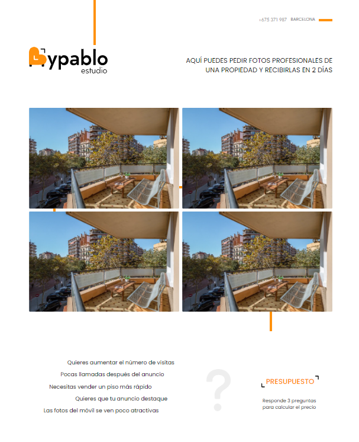

# BYPABLO

## Лендинг "Bypablo". Лендинг-презентация профессионального фотографа недвижимости в Испании. Заказ на фрилансе.

* Pug
* SCSS
* Native JavaScript
* Grid
* Responsive
* BEM
* Gulp

## Демо: [BYPABLO](https://volkovva.github.io/bypablo/)


## Установка проекта

* установить ```gulp``` глобально: ```yarn global add gulp-cli```
* скачать необходимые зависимости: ```yarn```
* чтобы начать работу, ввести команду: ```yarn run dev``` (режим разработки)
* чтобы собрать проект, ввести команду ```yarn run build``` (режим сборки)